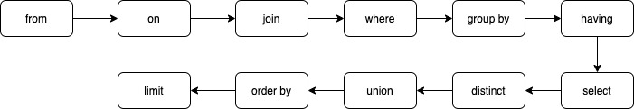

## SQL 执行流程
### Server 层
* 连接器：TCP 握手后服务器来验证登录用户身份，A 用户创建连接后，管理员对 A 用户权限修改了也不会影响到已经创建的链接权限，必须重新登录
* 查询缓存：查询后的结果存储位置
* 分析器：根据语法规则，判断你输入的这个 SQL 语句是否满足 MySQL 语法
* 优化器：多种执行策略可实现目标，系统自动选择最优进行执行
* 执行器：判断是否有权限将最终任务提交到存储引擎

### 存储引擎层
* InnoDB
* MyISAM
* Memory

### SQL 执行顺序

## BinLog、RedoLog、UndoLog
### BinLog
*记录所有数据库表结构变更以及数据修改的二进制日志，主从数据库同步用到的都是 BinLog 文件，BinLog 日志有三种模式：*
#### STATMENT 模式
#### ROW 模式
#### MIXED 模式
#### 主从同步流程
1. 主节点必须启用二进制日志，记录任何修改了数据的事件
2. 从节点开启一个线程（I/O Thread）把自己扮演成 mysql 客户端，通过 mysql 协议，请求主节点的二进制文件中的事件
3. 主节点启动一个线程（dump Thread），检查自己二进制中的事件，跟对方请求的位置对比，如果不带请求位置参数，则主节点会从第一个日志文件中的第一个事件一个一个的发送从节点。
4. 从节点接收到主节点发过来的数据把它放置在中继日志（Relay log ）中。并记录该次请求到主节点的具体的哪一个二进制文件的哪一个位置（主节点二进制文件会有多个）。
5. 从节点启动另一个线程（sql Thread），把 Relay log 中的事件读取出来，并在本地再执行一次。