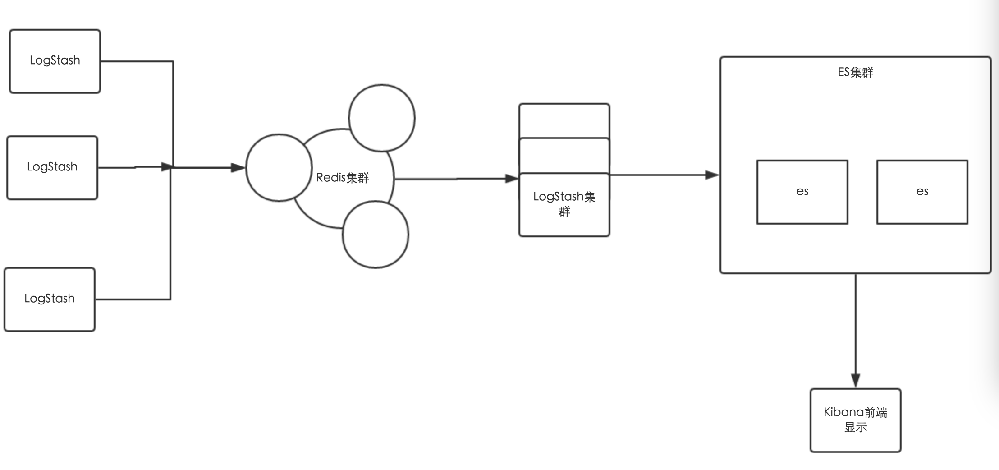

# ELK原理

- ELK 收集日志

1. LogStash Agent：在各台机器上部署的Agent，用来上传日志到队列
2. Redis: 接收日志的队列，削峰填谷，
3. Logstash集群：做日志解析，统一成 json 格式输出给 Elasticsearch ，json 格式的好处是直接
4. Elasticsearch：实时日志分析服务的核心技术，实时的数据存储服务，通过 index 组织数据，兼具强大的搜索和统计功能。
5. Kibana：基于 Elasticsearch 的数据可视化组件，前端操作非常方便，用鼠标几次点击即可完成搜索，聚合，生成报表等功能，这种可视化能力是大家选择 ELK Stack 的很重要的原因。
